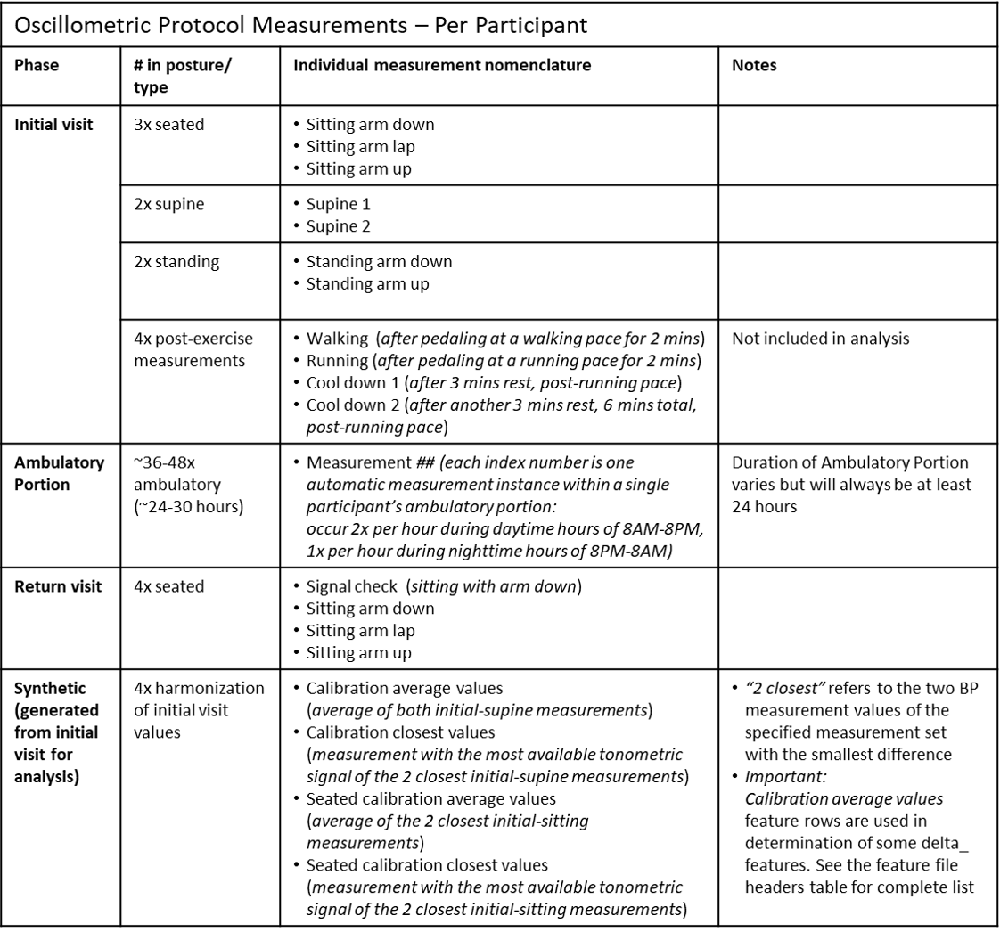
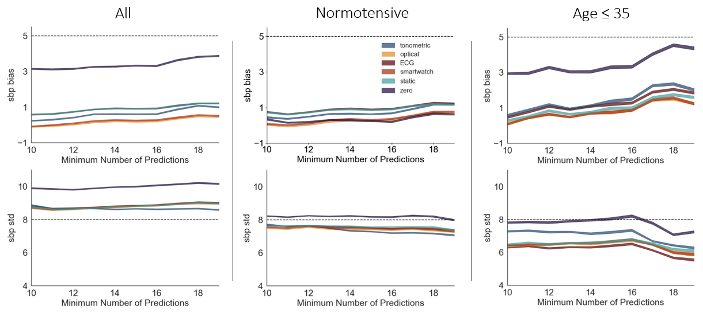
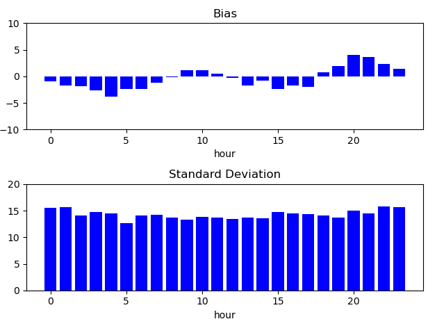

# Data and Protocol Details

## Data Use Application

To access the dataset, a data use application <!-- TODO insert link to DUA --> must be completed, including:

- Principal investigator information
  - Academic credentials, affiliation, contact information, curriculum vitae
- Additional investigator information
  - Academic credentials, affiliation, contact information
- Research proposal
- Acknowledgement to comply with data use agreement. <!-- TODO insert link to DUA --> Key points are listed below:
  - No sharing of data with anyone outside of approved PI and other specified investigators. New investigators must be reviewed.
  - No data use outside of stated proposal scope
  - No joining of data with other data sources
  - No attempt to identify participants, contact participants, or reconstruct PII
  - Storage with appropriate access control and best practices
  - You may publish (or present papers or articles) on your results from using the data provided that no confidential information of Microsoft and no Personal Information are included in any such publication or presentation
  - Any publication or presentation resulting from use of the data should include reference to the Aurora-BP Study, with full reference to the source publication <!-- TODO insert reference --> when appropriate
  - Aurora-BP Study authors and Microsoft are under no obligation to provide any support or additional materials related to the use of these data
  - Aurora-BP Study authors and Microsoft are not liable for any losses, damages, or harms of any kind in connection to the use of these data
  - Aurora-BP Study authors and Microsoft are not responsible or liable for the accuracy, usefulness or availability of these data
  - User will provide a signature of attestation that they have read, understood, and accept the data use agreement

---

## Protocol Overview

Institutional review board (IRB) approval for this study was obtained from WCG IRB (Puyallup, WA, USA). Individuals unable to consent in English, pregnant women, prisoners, institutionalized individuals, and individuals younger than 18 were excluded from participation due to their vulnerable status. In support of the overall goal of assessing the clinical feasibility of multiple cuffless BP techniques, subject recruitment intentionally targeted a heterogeneous pool of individuals. Participants were selected to balance across gender and self-reported hypertensive status.

Two separate protocols were performed---**auscultatory** and **oscillometric**---each using a different clinically-validated BP measurement technique. These protocols were non-concurrent, with each individual participant included in only a single protocol. In both protocols, a series of measurements were collected in two controlled in-lab visits at least 24 hours apart. During the oscillometric protocol, ambulatory measurements were also collected during the time between the in-lab visits. Ambulatory measurements were not feasible in the auscultatory protocol. Post-exercise measurements were collected in both protocols, but were not included in post-featurization analysis.

In both protocols, participants were fitted with three devices: a cuff-based, clinically-validated BP measurement device, a tonometric sensing device, and an optical sensing device. The tonometric device was worn on the wrist and fitted with a pressure sensor to measure the pulse pressure waveform at the radial artery. An extender could be used to adjust for participant comfort or signal strength of the tonometer. The optical sensing device was worn proximal to the tonometric sensing device. The optical sensing device used a standard PPG sensor placed on the anterior surface of the arm. Additionally, both devices had an ECG sensor (ADS1292) used to measure cardiac electrical activity and to time-align measurements across devices, with electrodes applied to measure Lead I ECG. The BP cuff was worn on the opposite arm as the tonometric and optical devices. BP cuff size was determined by measuring the upper arm circumference and selecting a cuff according to manufacturer specifications. Additional details regarding the tonometric and optical devices are provided below.

### Tonometric Sensing Device

The wrist-worn design of the tonometric device enables non-experts to properly place the sensor and capture high quality radial pulse pressure waves. The electronics in the tonometric device are distributed around the wrist to improve comfort with long-term wear, and a force concentrator is used over the pressure sensor (MS5803-02BA) to maximize signal quality. ECG sensing is provided via two exposed stainless steel bumps on the inner wrist (dry contacts) and a connection point for a standard wet electrode. The wet electrode wire is run up the participant's arm and connected to the chest on the opposite side of the heart. An accelerometer (LSM6DS3) is used to monitor arm posture and activity level.

Sensor Type | Part Number | Sampling Rate
----------- | ----------- | -------------
Pressure/Tonometer | [MS5803-02BA](https://www.te.com/commerce/DocumentDelivery/DDEController?Action=srchrtrv&DocNm=MS5803-02BA&DocType=Data+Sheet&DocLang=English) | 200 S/s
ECG         | [ADS1292](https://www.ti.com/product/ADS1292) | 488.28 S/s
Accelerometer | [LSM6DS3](https://www.st.com/en/mems-and-sensors/lsm6ds3tr-c.html) | 100 S/s

### Optical Sensing Device

The optical device resembles a large smart watch and records ECG and PPG signals. It incorporates a commercial PPG optical sensor (MAX30101) that sits underneath the watch body. The three ECG contacts are made via standard wet electrodes with two electrodes connected on the same arm as the device, and the third connected to the chest on the opposite side of the heart.  An accelerometer (LSM330) is used to monitor arm posture and activity level.

Sensor Type | Part Number | Sampling Rate
----------- | ----------- | -------------
Optical/PPG | [MAX30101](https://www.maximintegrated.com/en/products/interface/signal-integrity/MAX30101.html) | 250 S/s
ECG         | [ADS1292](https://www.ti.com/product/ADS1292) | 498.67 S/s
Accelerometer | [LSM330](https://media.digikey.com/pdf/Data%20Sheets/ST%20Microelectronics%20PDFS/LSM330.pdf) | 100 S/s

## Auscultatory Protocol

The auscultatory protocol aimed to collect and analyze radial pulse waveform information at two time points at least 24 hours apart. These sensor data were synchronized with simultaneous manual auscultatory BP measurements. The first visit consisted of device fitting and setup, postural, and post-exercise data collection. The second visit would occur the following day, at least 24 hours later, and would involve postural data collection and participant feedback.

### Auscultatory Device Setup

Auscultatory measurements were performed by trained expert observers using a dual-head stethoscope for paired auscultation BP measurements using the ADC Diagnostix 700/703 aneroid sphygmomanometer. In extenuating circumstances, single-observer auscultation was performed. <!-- TODO: Note how to identify single-observer data --> During paired auscultation, observers were blinded to each other's measurement determinations until the end of the visit. The brachial cuff was fitted to the participant's left or right arm (randomized). Cuff inflation and deflation were manually controlled by one of the observers.

### Auscultatory Initial Visit Measurements

Following equipment fitting and a ten-minute supine rest period, a series of manual BP measurements were taken with at least 60 seconds between each measurement and a five-minute rest in-position for each postural change. Measurements were taken for supine and seated postures, with arms resting on an adjustable table at the participant's heart height for the seated posture.

Two post-exercise measurements were collected following postural measurements, with three minutes of rest between each. Participants were instructed to pedal a recumbent stationary exercise bike for two minutes at a comfortable "jogging" pace and then immediately rest arms by their sides. BP was measured when the participant's heart rate (HR) reached a target HR defined to be an increase from resting HR of either 20 bpm or 20%, whichever was higher (e.g., for a resting HR of 65 bpm, use target of 85 bpm rather than 78 bpm).

### Auscultatory Return Visit Measurements

The return visit consisted of collection of feedback and a second series of supine and seated postural measurements equivalent to the initial visit.

### Auscultatory Measurements Overview

## Oscillometric Protocol

The oscillometric protocol aimed to collect and analyze ambulatory radial pulse waveform information over a period of at least 24 hours. These sensor data were synchronized with automated oscillometric BP measurements that occurred during the same time window. The protocol was executed in two visits at least 24 hours apart, with ambulatory measurements recorded in the time between visits. The first visit consisted of device fitting and setup, postural data collection, post-exercise data collection, and participant instruction for device use during the ambulatory phase between visits. The second visit would occur the following day, at least 24 hours later, and would involve seated posture data collection and participant feedback.

### Oscillometric Device Setup

Blood pressure was measured using the Spacelabs Healthcare OnTrak 90227 ambulatory BP monitor ("ABPM device"). The brachial cuff was fitted to the participant's dominant arm or according to the participant's preference. Cuff inflation and deflation were automatically controlled by the ABPM device. The tonometric device can be adjusted to multiple tightness levels. While tighter settings generally provide high-quality pressure waveforms, they are also less comfortable for long-term wear. Therefore, 3 band tightness levels were determined for each participant and marked on the band:

- daytime measurement tightness
- daytime tightness between measurements (one notch looser than daytime measurement tightness)
- nighttime tightness (approximately two notches looser than daytime measurement tightness)

### Oscillometric Initial Visit Measurements

Following equipment fitting and a ten-minute seated rest period, a series of operator-initiated blood pressure measurements were taken at least 60 seconds between each measurement and a five-minute rest in-position for each postural change. The participant would tighten the tonometric device to the “daytime measurement tightness” during measurements and loosen the device following measurements. Measurements were taken for the following postures:

Measurement Name    | Posture | BP-Cuff Arm Position  | Tonometric and Pressure Device Arm Position
------------------- | ------- | --------------------- | --------------------------------------------
Sitting arm down    | Seated  | Hanging along side of body | Hanging along side of body
Sitting arm lap     | Seated  | Hand in lap           | Hand in lap
Sitting arm up      | Seated  | Hand in lap           | Held at heart height
Supine 1            | Supine  | Resting along side of body | Resting along side of body
Supine 2 (repetition) | Supine | Resting along side of body | Resting along side of body
Standing arm down   | Standing | Hanging along side of body | Hanging along side of body
Standing arm up     | Standing | Hanging along side of body | Held at heart height

Four post-exercise measurements were collected following postural measurements. Participants were instructed to pedal a recumbent stationary exercise bike for two minutes at a comfortable "walking" pace and then immediately rest arms on by their sides for an operator-initiated blood pressure measurement. Then participants were instructed to pedal for two minutes at a "running" pace and then immediately rest arms on by their sides for an operator-initiated blood pressure measurement. Two post-running cool down measurements were taken: after three minutes of rest and after 6 minutes of rest. A heart rate target was not used in the oscillometric protocol.

### Oscillometric Ambulatory Phase Measurements

Between the initial visit and the return visit, participants were instructed to wear all of the devices continuously and go through the measurement procedure whenever feasible (i.e., not when driving). BP measurements were triggered automatically every 30 minutes during waking hours (defined as approximately 8AM-8PM) and every 60 minutes at nighttime (defined as approximately 8PM-8AM). These measurement intervals are consistent with recommendations from the European Society of Hypertension.

#### Synchronization of Devices

Synchronizing the measurement timing of the tonometric and optical devices and the ABPM device during the ambulatory phase of the study was challenging, as the ABPM device did not provide any guarantee of when measurements would occur: only that a certain number of measurements would occur during a given time-frame. The ABPM device was regular in the timing of measurements (e.g., if a measurement occurred at 8:17 am, then subsequent measurements would occur at 8:47 am, 9:17 am, etc.), however the offset (x:17 in the case above), was not deterministic and required observation. To accomplish this, the ABPM device was put into automated measurement mode well before the initial visits so this offset could be recorded.

The tonometric and optical devices were then programmed to begin taking each measurement during the ambulatory phase approximately two minutes before this offset, and to continue measuring until two minutes after this offset, ideally recording data during the entire BP measurement. On occasions where the BP measurement was repeated due to measurement failure, and the subsequent measurement succeeded, there is no longer any guarantee that the data collected from the pressure and optical devices was collected during the exact same time period as the BP measurement.

### Oscillometric Return Visit Measurements

The return visit consisted of participant feedback and a second series of automated oscillometric measurements, identical to the initial visit. The participant was asked for feedback and also asked whether they removed any of the devices during the 24-hour ambulatory phase, and if so, they were asked approximately when and for how long. If the participant arrived with any devices removed they were instructed to put them back on. After a 5-minute seated rest period, seated postural measurements were repeated.

### Oscillometric Measurements Overview

---

## Supplemental Analyses

### Varying Minimum Number of Measurements

Comparisons of ECG, optical, and tonometric feature group performance against smart watch, static, and zero baselines are shown below for systolic BP (SBP) and diastolic BP (DBP). Both bias and standard deviation in BP estimation are reported across a range of minimum number of measurements available for participants in each subset. A lower minimum number of measurements was the most inclusive of participants with fewer usable measurements and a higher minimum was more stringent.

SBP prediction results after 24-hour wear. Shaded regions indicate 95% confidence bound values calculated via bootstrapping. All feature groups fall below 5 mmHg bias, but only achieve < 8 mmHg standard deviation for normotensive and young subpopulations. The tonometric estimates exhibit a lower standard deviation than other feature groups overall and among normotensives.

DBP prediction results after 24-hour wear. Shaded regions indicate 95% confidence bounds. As with SBP, all feature groups exhibit a bias < 5 mmHg. All feature groups also achieve a standard deviation < 8 mmHg, although the zero baseline performs worse than the other feature groups and tonometric performs better overall and on normotensives than on the young subpopulation.

### Error by Time of Day

Bias and standard deviation of SBP prediction were evaluated by time of day for both the tonometric and optical feature groups. Given our sinusoidal time feature, the bias takes on a similarly sinusoidal shape; however, the values still remain < 5 mmHg throughout daytime and nighttime hours. Standard deviation of prediction exhibits little change, but is observed to decrease slightly during daytime hours for both feature groups.

Tonometric feature group

Optical feature group

